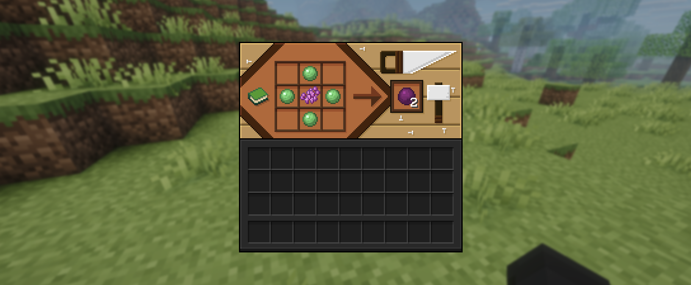

# ReallyBouncyBalls

A Fabric mod that adds a **Bouncy Ball**: a throwable, dyeable ball that ricochets off
everything it touches instead of just splatting on the first wall it meets.

**[⬇ Download on Modrinth](https://modrinth.com/mod/reallybouncyballs)**

## The Bouncy Ball

Craft one by putting a dye in the middle of a ring of slime balls. Every colour has its own
recipe, so you pick the colour when you make it:



Already have a ball and want a different colour? Combine it with any dye in a crafting grid.
The ball keeps its colour while it flies, so you can tell whose ball is whose.

Right-click to throw. The ball bounces off blocks and mobs, loses a bit of speed each time,
and once it is out of bounces it simply drops on the ground as an item. Walk over and pick
it up again.

## Bouncing

Some surfaces behave differently:

| Surface | What happens |
| --- | --- |
| Slime block | Bounces back roughly 70% harder |
| Honey block, soul sand | Swallows the bounce, so the ball lands right there |
| Entities | Bounces off, harmlessly |
| Everything else | A normal bounce |

A bounce that would end up too slow to be interesting stops early, so balls do not dribble
around your feet forever.

## Enchantments

**Bounciness** (I to III) is a new enchantment for the ball. You can roll it at an enchanting
table or apply it from a book on an anvil. Higher levels mean more bounces and less speed
lost per bounce:

| Level | Bounces | Speed kept per bounce |
| --- | --- | --- |
| None | 3 | 62% |
| I | 5 | 71% |
| II | 7 | 80% |
| III | 9 | 89% |

**Loyalty** also works. A loyal ball, once it has run out of bounces, flies back to you
through walls and lands in your inventory, the same way a loyal trident does.

## Requirements

- Minecraft 26.2
- Fabric Loader 0.19.3+
- [Fabric API](https://modrinth.com/mod/fabric-api)
- [Fabric Language Kotlin](https://modrinth.com/mod/fabric-language-kotlin)
- Java 25

Works on both client and server. On a multiplayer server, clients need the mod too.

## Building from source

```
./gradlew build
```

The finished jar lands in `build/libs/`. To try it out in a dev environment, use
`./gradlew runClient` or `./gradlew runServer`.

## License

Licensed under the GNU Affero General Public License v3.0. See [LICENSE](LICENSE).
